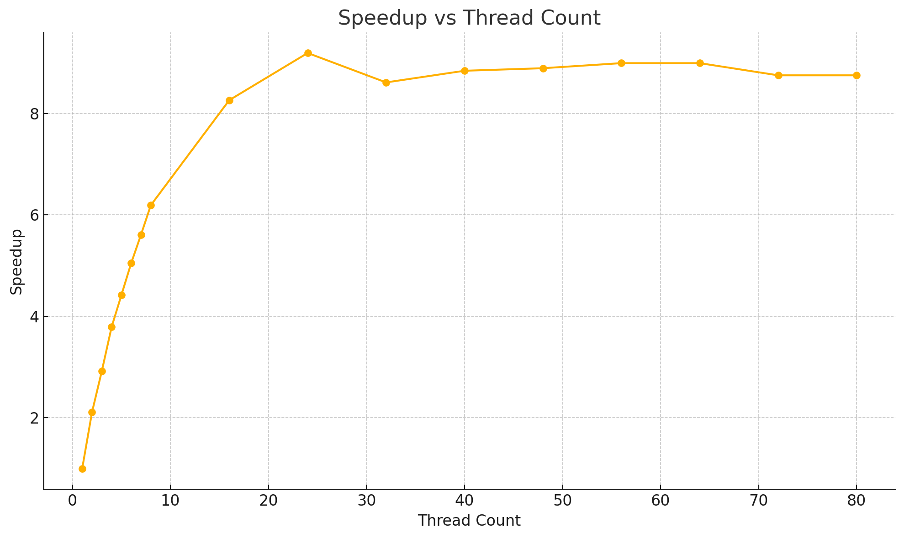

**Questions:**

1.  Notice that there is a maximum speed-up factor, but not necessarily using the most threads. Make a guess (i.e., write a short paragraph) as to why you think more threads aren't necessary better. Here's a hint: think about a group of people waiting to go through a turnstile (like at BART or Disney World). Are more people able to go through it just because there are more people?

In terms of the turnstile analogy, a bottleneck seems to exist that limits the number of threads 
that can "enter" the program and be utilized. In the case of hash-04, those bottlenecks seem to 
represent the sequential operations of the hashing algorithms. Only a certain percentage of hash-04
is parallel, so you will only be able to speed up that percentage of your program by using more 
threads.
	

2. Do you think it’s possible to get “perfect scaling” — meaning that the (1-p) terms is zero?

Perfect scaling is only theoretically possible if p = 1. However, in practice there is always going 
to be a sliver of serialized code in every program. Therefore p can will only ever approach 1, just 
how a mathematical limit approaches infinity. You can only ever get arbitrarily closer to infinity 
(or in this case 1). As far as I know, every program has some amount of serial code.

3. For your own timings, compute your expected speed-up for 16 cores.

Given the following timing results from running ./timed 1:

	main program 0.008084557 s
	results output 6.34e-07 s
	main program 14.349108533 s

	serial % = 0.000563 (or 0.056%)
	parallel % = 1 - 0.000563 = 0.9994 (or 99.94%)

Assuming we are using n = 16 threads, our speedup is calculated like so:

$$ speedup = \frac{1}{1 - 0.9994 + \frac{0.9994}{16}} = 15.857 $$

4. in reviewing the graph of speed-ups to number of threads, note that we get pretty linear (when you plot the dots, they’re pretty close to being a line) speed-up. What’s the slope of that line? (Pick two values, like for one and seven threads, and do the rise-over-run thing you learned in Algebra). Does that linear trend continue as we add more threads? What do you think causes the curve to “flatten out” when we use large thread counts?

The slope from 1 thread to 7 is: 

$$ m = \frac{3.85}{6} = 0.64 $$

This is a fairly steep slope, but we will see it become more shallow as we expand our thread range

The slope from 1 thread to 24 is:

$$ m = \frac{6.33}{23} = 0.28 $$

The slope begins to dramatically flatten out as we see an upper limit to our speedup with higher threads. 
It is worth pointing out that this slope doesn't have line up with our graph like it did with the slope 
between threads 1 and 7. After thread 7 our line we draw between points becomes much less linear, adopting
a gradual curve until it flattens out after 24 threads. This is simply a by-product of our Speedup values
increasing less and less, even declining between certain threads (between 24 and 32 threads). 

